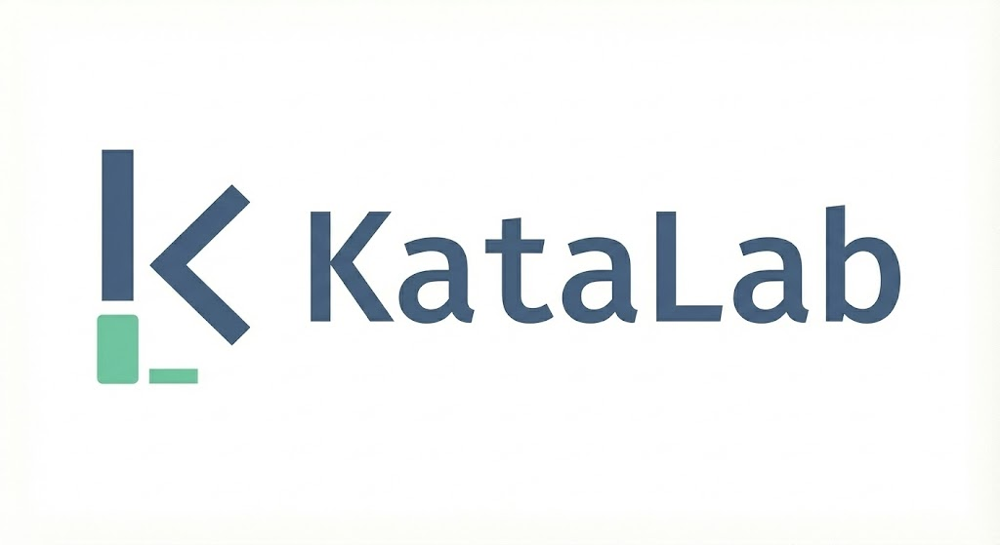

# Katalab



Turn company documents into coding katas for custom employee team onboarding.

Built entirely with Antigravity and Google AI Studio.

## Overview


Katalab parses company context (CVs, engineering blogs, job specs) and uses an Agent to design and generate a custom "Coding Kata" repository tailored to that company's stack and values.

## Structure

- **Backend**: FastAPI application (`src/backend`)
- **Frontend**: Vanilla JS/CSS web interface (`src/frontend`)
- **Agent**: Gemini powered planning and generation.

## How to Run

The frontend is served statically by the backend, so you only need to run the Python application.

1.  **Install Dependencies**:
    ```bash
    uv sync
    ```

2.  **Set Environment Variables**:
    Ensure you have a `.env` file with `GOOGLE_API_KEY`.

3.  **Run the App**:
    ```bash
    uv run uvicorn src.backend.main:app --reload
    ```

4.  **Access the UI**:
    Open [http://localhost:8000](http://localhost:8000).

## Usage

1.  Upload documents.
2.  Review the generated plan.
3.  Provide feedback to refine the plan.
4.  Click "Approve & Build" to generate and download the Kata repository.
